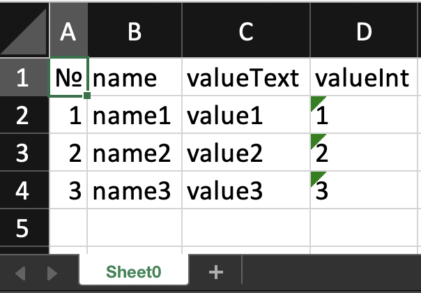
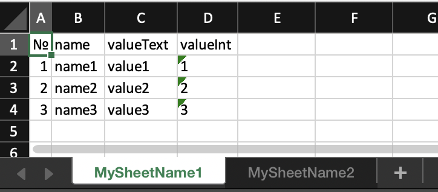

# pojo-to-xlsx
Generates excel xlsx document from POJO. Based on "apache poi" library.

## add to project:

Maven:
```xml
<dependency>
    <groupId>io.github.ilyakastsenevich</groupId>
    <artifactId>pojo-to-xlsx</artifactId>
    <version>1.0.0</version>
</dependency>
```

Gradle:
```groovy
implementation 'io.github.ilyakastsenevich:pojo-to-xlsx:1.0.0'
```

## code example:
```java
@AllArgsConstructor
public class YourPojo {
    // fields' names will become columns' headers
    // values will become cells' values
    private String name;
    private String valueText;
    private Integer valueInt;
}
```
```java
    //create your input object, it can be of any class
    YourPojo row1 = new YourPojo("name1", "value1",  1);
    YourPojo row2 = new YourPojo("name2", "value2",  2);
    YourPojo row3 = new YourPojo("name3", "value3",  3);

    XlsxGenerator xlsxGenerator = XlsxGenerator.getInstance();

    byte[] result = xlsxGenerator.generateXlsx(List.of(row1, row2, row3));
```
Result:


```java
    //create your input object, it can be of any class
    YourPojo row1 = new YourPojo("name1", "value1",  1);
    YourPojo row2 = new YourPojo("name2", "value2",  2);
    YourPojo row3 = new YourPojo("name3", "value3",  3);

    //result xlsx will contain 2 sheets
    String sheetName1 = "MySheetName1";
    String sheetName2 = "MySheetName2";

    XlsxGenerator xlsxGenerator = XlsxGenerator.getInstance();

    Map<String, List<?>> inputMap = new LinkedHashMap<>();
    inputMap.put(sheetName1, List.of(row1, row2, row3));
    inputMap.put(sheetName2, List.of(row1, row2, row3));

    byte[] result = xlsxGenerator.generateXlsx(inputMap);
```
Result:
